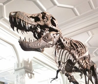

# Project - Lists - Recipe

[Source: Coder](https://googlecreativelab.github.io/coder-projects/projects/perfect_recipe/)

## Reading

[HTML Lists overview](http://htmldog.com/guides/html/beginner/lists/)

[HTML Lists in depth](https://www.w3schools.com/html/html_lists.asp)

## Instructions

Make a file `recipe.html` that renders a recipe. It should look similar to this:

Include the following:

1. A main heading. `<h1>`
2. A description. `
`
3. An unordered list of ingredients. `<ul>`
4. An ordered list of directions. `<ol>`
5. Add a link to a similar recipe somewhere online. 

### Bonus

* Add an image below the main heading ``

# Project - Embedding an Image

[Source: Images in HTML, by Mozilla Contributors](https://developer.mozilla.org/en-US/docs/Learn/HTML/Multimedia_and_embedding/Images_in_HTML)

## Readings

[HTML Images Overview](http://htmldog.com/guides/html/beginner/images/)

[In depth HTML Images](https://www.w3schools.com/html/html_images.asp)

## Instructions

### Exercise

Create an HTML document image.html and embed the following image in an HTML document:

Also, do the following:

* Add some `alt` text, and check that it works by misspelling the image URL.
* Set the image's correct `width` and `height` (hint; it is 200px wide and 171px high), then experiment with other values to see what the effect is.
* Set a `title` on the image.
